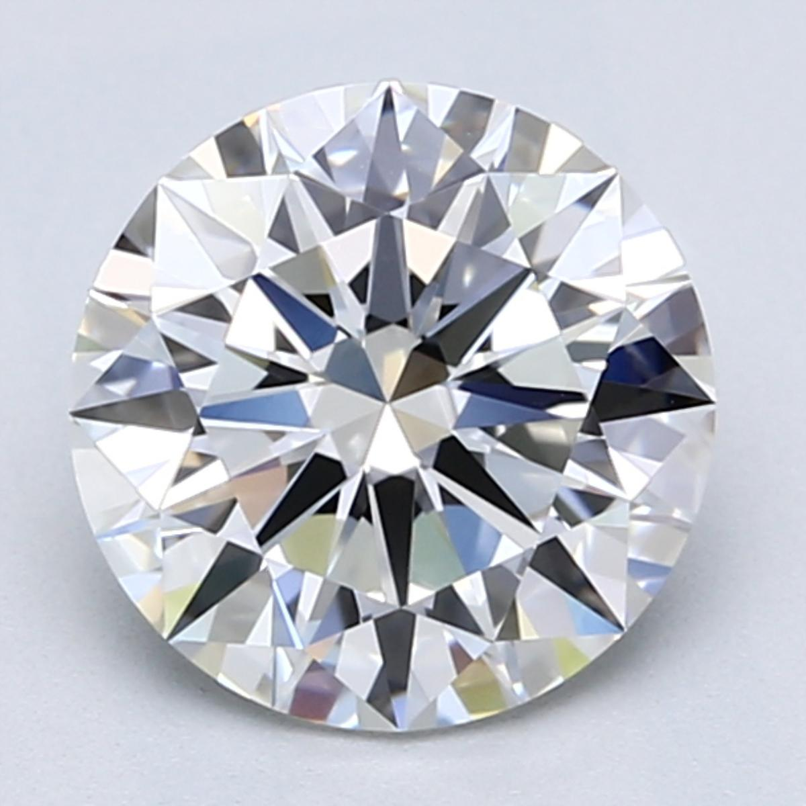
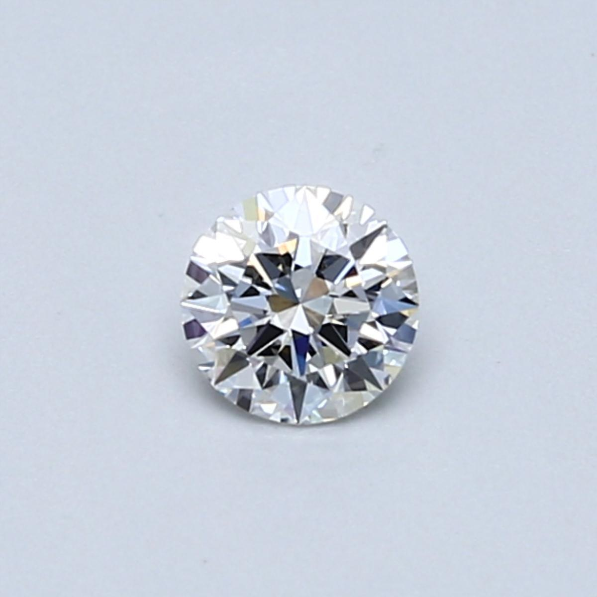
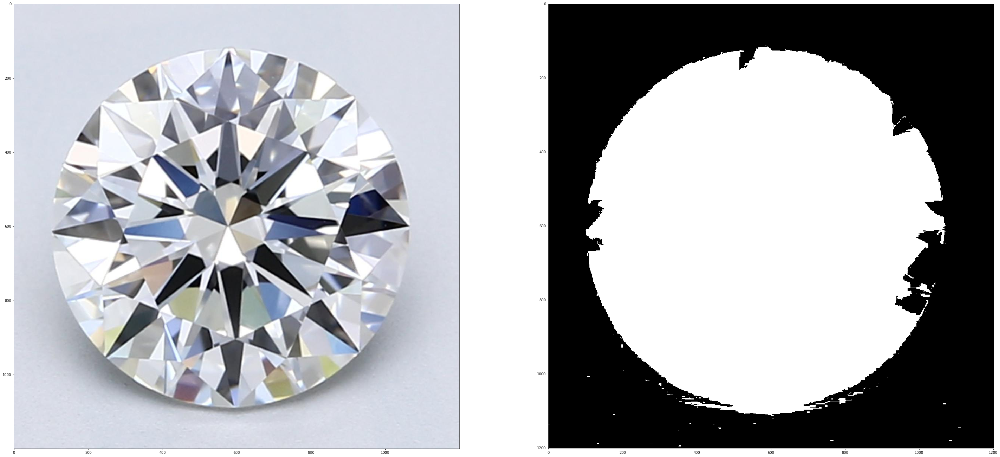
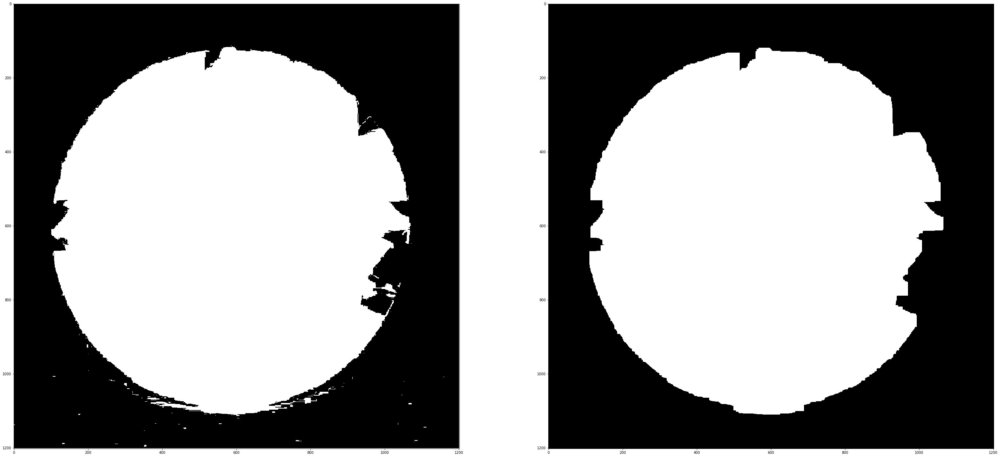
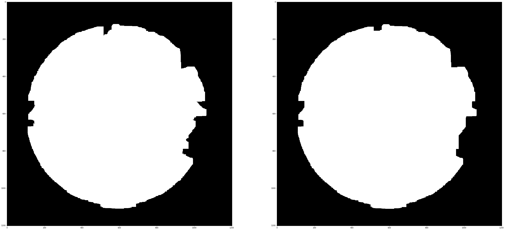
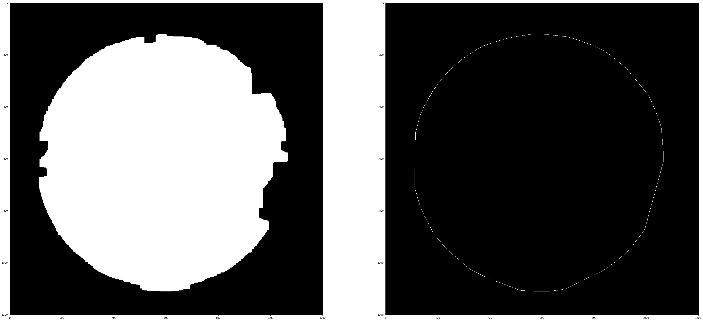
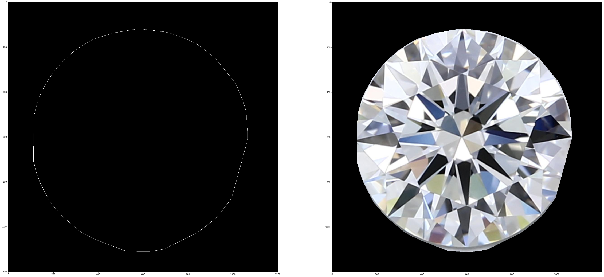

# Problem
Image with a uniform background with diamond as the foreground. Extract the diamond from the image.

## Sample images
<table>
    <tr>
        <td>  </td>
        <td>  </td>
    </tr>
</table>

## Approach
We see that the background is of uniform colour. Seems that it could be extracted out. Let's first take care of our imports.


```python
import numpy as np
import cv2
import matplotlib.pyplot as plt

from IPython.display import display, Image

# This is done to bring the utils folder into the path
import os
import sys
module_path = os.path.abspath(os.path.join('..'))
if module_path not in sys.path:
    sys.path.append(module_path)

from utils import contours, morphology
```

We then set the input image paths.


```python
img_path = r'input/diamond1.jpg'
```

We could extract the background by analyzing the histogram of the image. But using flood fill seems a better way, as there is a sharp contrast between background and the foreground.


```python
img = cv2.imread(img_path)

h, w, _ = img.shape
mask = np.zeros((h + 2, w + 2), np.uint8)

floodflags = 4
floodflags |= (255 << 8)
floodflags |= cv2.FLOODFILL_MASK_ONLY

seed = (0, 0)
low = 2
high = 2
_, _, mask, _ = cv2.floodFill(img, mask, seed, (255, 0, 0), (low,) * 3, (high,) * 3, floodflags)
mask = 255 - mask

_, axarr = plt.subplots(1, 2, figsize=(50, 50))
axarr[0].imshow(cv2.cvtColor(img, cv2.COLOR_BGR2RGB))
axarr[1].imshow(mask, cmap='gray')
```


    <matplotlib.image.AxesImage at 0x7ff7efc512e8>





Ok, not perfect. Some pixels in the background were marked as foreground, while some foreground were marked as background. Let's try to clean the image using the opening morphological operation.


```python
kernel = morphology.get_kernel(30)
mask_opened = morphology.opening(mask, kernel)

_, axarr = plt.subplots(1, 2, figsize=(50, 50))
axarr[0].imshow(mask, cmap='gray')
axarr[1].imshow(mask_opened, cmap='gray')
```


    <matplotlib.image.AxesImage at 0x7ff7efbf6be0>





Better. So we managed to remove the noise from the background but aggrevated the holes in the foreground in the process. Let's try to fill the holes in the foreground.


```python
mask_opened_closed = morphology.closing(mask_opened, kernel)
                              
_, axarr = plt.subplots(1, 2, figsize=(50, 50))
axarr[0].imshow(mask_opened, cmap='gray')
axarr[1].imshow(mask_opened_closed, cmap='gray')
```


    <matplotlib.image.AxesImage at 0x7ff7efb38048>





Not much of a difference, but we managed to fill some small holes in the diamond. We still miss some major part of the diamond near the boundaries. Let's try the convex hull algorithm to see if we can get the general shape of the diamond.


```python
cnts = contours.get_contours(mask_opened_closed)
hulls = contours.get_convex_hull(cnts)
img_hull = contours.write_contours(hulls, mask_opened_closed.shape)

_, axarr = plt.subplots(1, 2, figsize=(50, 50))
axarr[0].imshow(mask_opened_closed, cmap='gray')
axarr[1].imshow(img_hull, cmap='gray')
```


    <matplotlib.image.AxesImage at 0x7ff7efa6a898>





Although not perfect, we do manage to capture the general shape of the diamond. We'll now run the flood fill algorithm again, this time providing this hull image as the mask. This will prevent flood fill from filling the parts inside the hull. This time we will modify the original image and mark the pixels selected by flood fill as background, thus leaving us only with the foreground.


```python
floodflags = 4
floodflags |= (255 << 8)
low = 100
high = 100
_, _, mask, _ = cv2.floodFill(img, np.copy(img_hull), seed, (0, 0, 0), (low,) * 3, (high,) * 3, floodflags)

_, axarr = plt.subplots(1, 2, figsize=(50, 50))
axarr[0].imshow(img_hull, cmap='gray')
axarr[1].imshow(cv2.cvtColor(img, cv2.COLOR_BGR2RGB))
```


    <matplotlib.image.AxesImage at 0x7ff7ef9a5400>





Excellent! We manage to capture most of the diamond, with very little border distortions.
